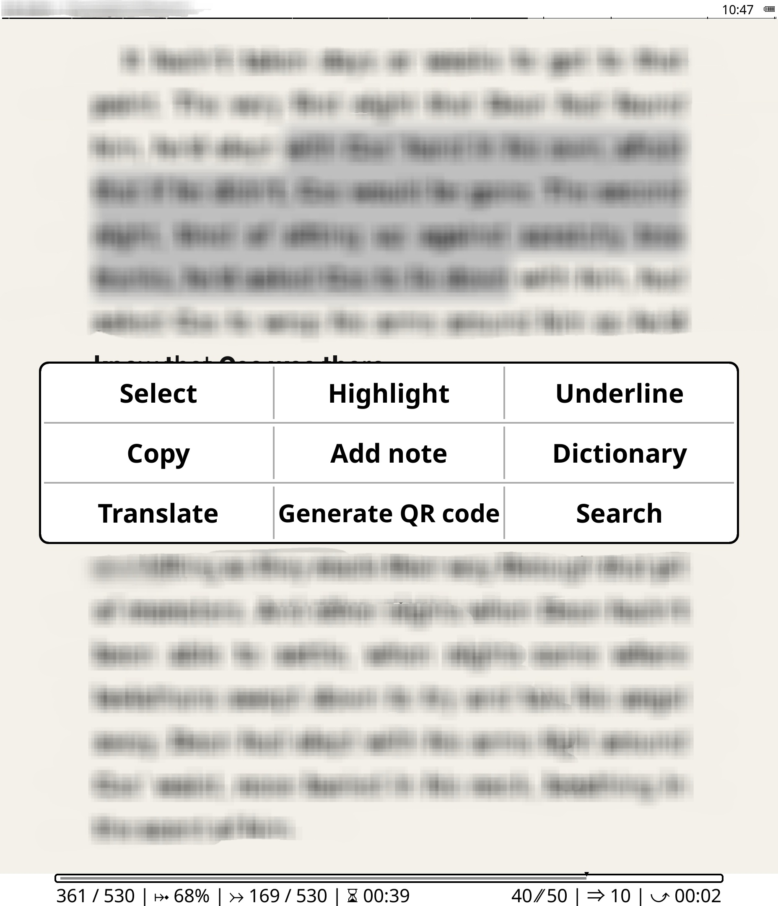

## [2-row-highlight-menu.lua](2-row-highlight-menu.lua)

A patch to be able to modify the number of rows or columns in the Select Text Menu, without modifying source code files.

  
**Features:**
- Ability to choose the number of columns OR rows (but not both) in the Select Text Menu
  - I.e. can be used to create a single row of button icons
  - Independent to any changes to the source ReaderHighlight:onShowHighlightMenu
        as long as ButtonDialog is still called (and hasn't changed)
  - Works with my CustomHighlightMenu patch and 2-underline-option-in-menu.lua patch

**Example with 3 Rows**

**Considerations:**
- If changes are made to ButtonDialog, usability may be impaired

---

